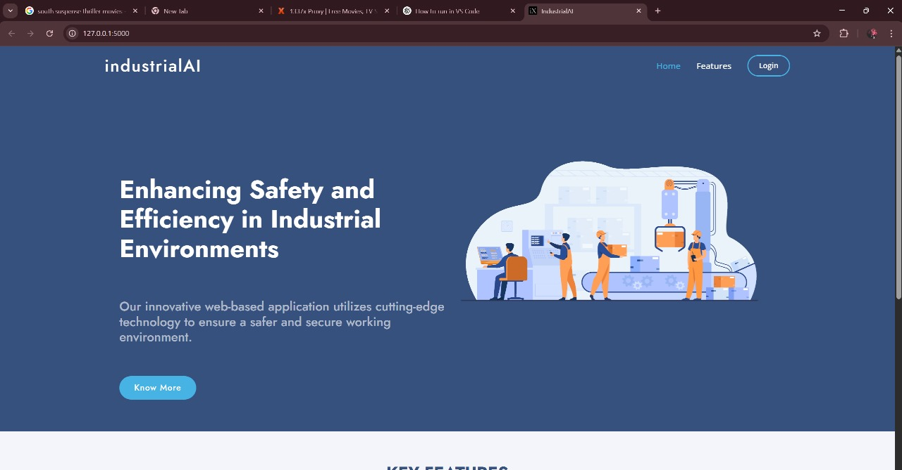
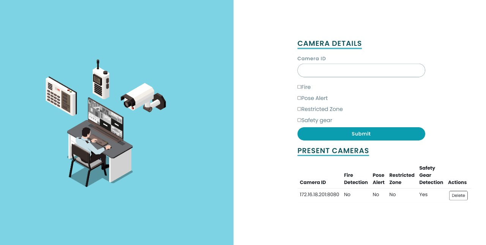
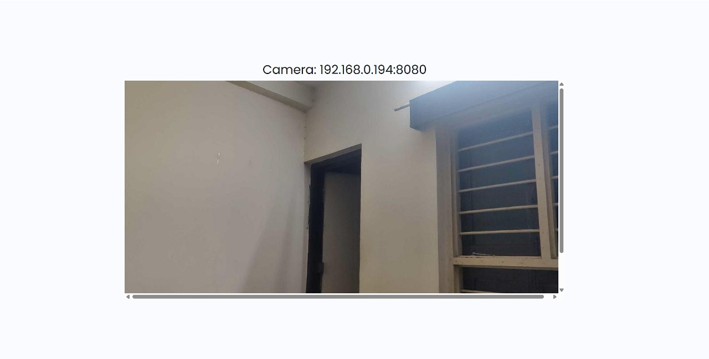
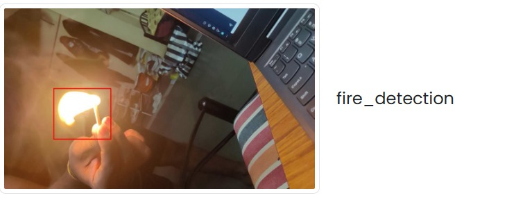
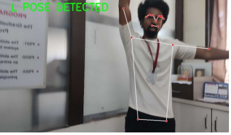
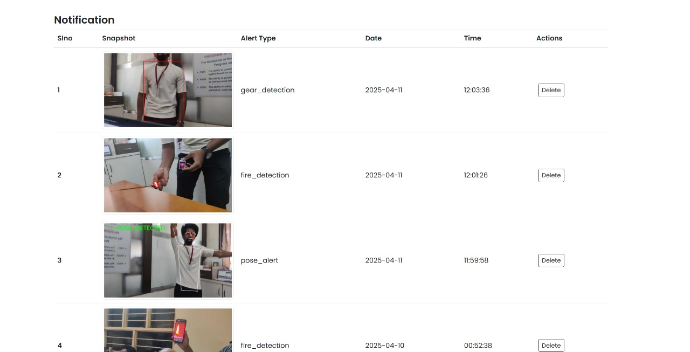

# Industrial AI Project

## Introduction

The **Industrial AI – Real-Time Safety Monitoring System** is a computer vision–based project designed to improve safety in industrial environments. By integrating AI with live video feeds, it automates the detection of critical safety violations and conditions in real time.

This project supports multiple monitoring features:

- 🔥 **Fire Detection**: Detects flames using deep learning or color-based analysis.
- 🦺 **Safety Gear Detection**: Identifies if workers are wearing required protective equipment like helmets and vests.
- 🚫 **Restricted Area Monitoring**: Alerts when unauthorized personnel enter off-limits zones.
- 🧍 **Pose Alert System**: Detects abnormal or dangerous body postures (e.g., falling, unsafe bending) using pose estimation.

### 📌 Key Highlights

- 📱 **IP Webcam Integration**: Uses your mobile device as a live camera stream source.
- 🌐 **Web Dashboard**: User-friendly interface for camera setup, detection mode selection, and alert viewing.
- 🧠 **AI-Powered Vision**: Built using Python, OpenCV, MediaPipe, and optionally YOLO models.
- 🖥️ **Runs Locally**: No cloud dependencies — ideal for offline, secure industrial settings.

This project demonstrates how **Artificial Intelligence and Machine Learning** can enhance workplace safety, operational awareness, and incident prevention in real-time.

## 🎯 Outputs

### Home Page


### Camera Details


### Camera POV


### Fire Detaction


### Pose Alert


### Notification Log


---

## 📂 Project Structure

```
Industrial-AI/
├── instance/
│   ├── alerts
│   ├── cams
│   └── user
├── models/
│   ├── fire.pt
│   ├── fire_detection.py
│   ├── gear.pt
│   ├── gear_detection.py
│   ├── pose.py
│   └── restricted_zone.py
├── outputs/
├── static/
│   ├── audio/
|   │   └── fire.mp4
│   ├── css/
│   ├── img/
│   └── js/
├── template/
├── app.py
├── requirememnts.txt
└── yolov8n.pt


```

## Getting Started

### Cloning the Repository
To get started, you can either clone the repository using Git or download it as a ZIP file:

- **Using Git**:
     ```bash
     git clone https://github.com/jadhav-onkar/Industrial-AI
     ```
     ```bash
     cd Industrial-AI
     ```

- **Download ZIP**:
  1. Go to the repository's main page.
  2. Click the green **Code** button and select **Download ZIP**.
  3. Extract the ZIP file to your desired directory.
  4. Open the extracted folder in Visual Studio Code, or navigate to it using the terminal.

## Execution Instructions

### Step 1: Check Python Version
Ensure you have the correct Python version installed (Python 3.10.0 is required).

1. Open a terminal in the project directory and check your Python version:
   ```bash
   py -3.10 --version
   ```
   or
   ```bash
   python3.10 --version
   ```

2. If Python 3.10.0 is installed, proceed to **Step 2**.

3. If your Python version is higher (e.g., 3.11 or 3.12) or lower, you need to install Python 3.10.0:
   - Download the Python 3.10.0 Windows installer from the [official Python website](https://www.python.org/downloads/release/python-3100/).
   - During installation, **do not** check the "Add Python to PATH" option.
   - After installation, restart your computer.
   - Verify the installation in the project directory:
     ```bash
     py -3.10 --version
     ```
     or
     ```bash
     python3.10 --version
     ```
     Ensure it displays Python 3.10.0.

### Step 2: Set Up a Virtual Environment
1. Create a virtual environment using Python 3.10.0:
   ```bash
   py -3.10 -m venv env
   ```
   or
   ```bash
   python3.10 -m venv env
   ```

2. Activate the virtual environment:
   - On Windows:
     ```bash
     env\Scripts\activate
     ```
   - On macOS/Linux:
     ```bash
     source env/bin/activate
     ```

   After activation, you should see `(env)` in your terminal prompt.

### Step 3: Install Dependencies
1. Install the required packages listed in `requirements.txt`:
   ```bash
   pip install -r requirements.txt
   ```
> Note: It may take a few minutes to install all the required packages during setup.

2. Install the MediaPipe library:
   ```bash
   pip install mediapipe
   ```

### Step 4: Run the Application
1. Start the application:
   ```bash
   python app.py
   ```

2. The application will running on http://localhost:5000 . Sign up and log in to access the dashboard.

### Step 5: Configure IP Webcam
1. Download and install the **IP Webcam** mobile app on your phone.
2. Start the server from the IP Webcam app. Ensure your phone and laptop are connected to the same Wi-Fi network.
3. Note the IP address displayed in the IP Webcam app (e.g., `192.168.0.2:8080`).

### Step 6: Configure the Dashboard
1. In the web interface, navigate to the **Camera** tab on the dashboard.
2. Enter the IP address from the IP Webcam app (e.g., `192.168.0.2:8080`).
3. Select one of the following detection options:
   - Fire Detection
   - Safety Gear Detection
   - Restricted Area Monitoring
   - Pose Alert (detects an L-shaped pose: person standing with one hand raised and the other extended horizontally to form an "L" shape)
4. Click the **Home** button and hit **Refresh** to start processing.
5. View the results on the **Alerts** page.

## Notes
- Ensure your phone and laptop remain connected to the same Wi-Fi network for the IP Webcam to work.
- For the Pose Alert model, the L-shaped pose requires a person to stand with one hand raised vertically and the other extended horizontally to the left, forming an "L" shape.
- If you encounter issues, verify that all dependencies are correctly installed and that Python 3.10.0 is being used in the virtual environment.
